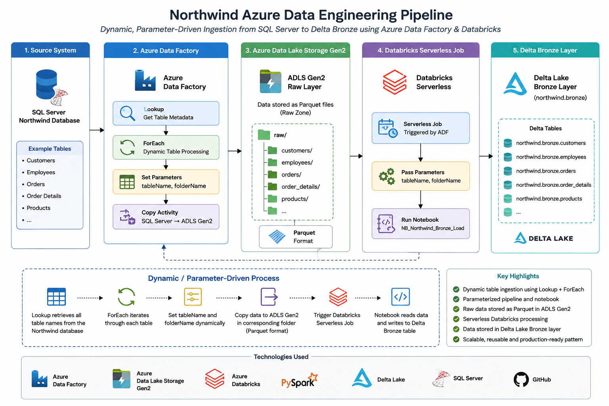

# Northwind Azure Data Engineering Pipeline

## Overview

An end-to-end data engineering project built using Azure Data Factory, Azure Data Lake Storage Gen2, Azure Databricks, PySpark, and Delta Lake.

The solution extracts data from a SQL Server Northwind database, dynamically ingests multiple tables into Azure Data Lake Storage Gen2 as Parquet files, and loads the data into Delta Bronze tables using Databricks.

The architecture is parameter-driven and reusable, allowing multiple source tables to be processed without creating a separate pipeline for every table.
## Architecture


---

## Architecture

```text
SQL Server
    |
    | Dynamic table extraction
    v
Azure Data Factory
    |
    | Lookup table metadata
    v
ForEach - Dynamic Table Processing
    |
    +------------------------------+
    |                              |
    v                              v
ADLS Gen2 Raw Layer          Databricks Serverless
    |                              |
    | Parquet                      | PySpark
    |                              |
    +--------------+---------------+
                   |
                   v
             Delta Bronze
          northwind.bronze
```

---

## Technologies

- Azure Data Factory
- Azure Data Lake Storage Gen2
- Azure Databricks
- Databricks Serverless Jobs
- PySpark
- Delta Lake
- SQL Server
- GitHub

---

## Key Features

### Dynamic Table Processing

Instead of creating a separate pipeline for every table, the solution uses an ADF Lookup activity to retrieve table metadata and a ForEach activity to process the tables dynamically.

### Parameterized Data Movement

Table names and folder names are passed dynamically through ADF parameters.

Example:

```text
tableName  = Customers
folderName = customers
```

The same logic can then process tables such as:

```text
Customers
Orders
Order Details
Products
Employees
...
```

without modifying the pipeline for each table.

### ADLS Gen2 Raw Layer

Source data is stored in Azure Data Lake Storage Gen2 in Parquet format.

Example:

```text
raw/
├── customers/
├── employees/
├── orders/
├── order_details/
├── products/
└── ...
```

### Databricks Bronze Layer

The Databricks notebook reads the dynamically supplied table and folder parameters and loads the data into Delta tables.

Example:

```text
northwind.bronze.customers
northwind.bronze.orders
northwind.bronze.products
```

### Serverless Databricks Processing

The Bronze load can be executed using a Databricks Serverless Job, avoiding the need to maintain a long-running interactive cluster.

---

## Pipeline Flow

The overall process is:

1. Connect to the Northwind SQL Server database.
2. Retrieve the list of source tables using ADF Lookup.
3. Iterate through the tables using ADF ForEach.
4. Dynamically identify the source table and target folder.
5. Copy source data from SQL Server to ADLS Gen2.
6. Store the raw data as Parquet.
7. Trigger the Databricks Bronze load.
8. Pass `tableName` and `folderName` dynamically to the notebook.
9. Read the corresponding Parquet data.
10. Write the data into Delta Bronze tables.

---

## Databricks Notebook

The project uses a reusable PySpark notebook:

```text
databricks/
└── notebooks/
    └── NB_Northwind_Bronze_Load.py
```

The notebook accepts:

```text
tableName
folderName
```

as parameters, allowing the same notebook to process multiple tables.

---

## Source Control

Azure Data Factory is integrated with GitHub for source control.

ADF resources are maintained as JSON definitions, including:

- Pipelines
- Datasets
- Linked Services
- Integration Runtime configuration
- Factory configuration

The Databricks notebook is maintained separately as a Python source file.

---

## Security

Credentials and authentication secrets are intentionally excluded from the portfolio documentation.

Sensitive credentials such as passwords, access tokens, storage keys, and SAS tokens should never be committed to source control.

For a production implementation, secure authentication should be managed using mechanisms such as Azure Key Vault, managed identity, or other supported secret-management approaches.

The linked-service configurations in this repository may contain environment-specific encrypted credential metadata generated by Azure Data Factory. These values are not intended to be used as credentials outside the originating Azure environment.

---

## Repository Structure

```text
northwind-azure-data-engineering/
│
├── README.md
│
├── databricks/
│   └── notebooks/
│       └── NB_Northwind_Bronze_Load.py
│
├── dataset/
├── factory/
├── integrationRuntime/
├── linkedService/
└── pipeline/
```

---

## Project Objective

The primary objective of this project is to demonstrate a reusable, parameter-driven Azure data ingestion architecture capable of processing multiple relational database tables with minimal manual configuration.

The project demonstrates practical experience with:

- Cloud data ingestion
- Azure Data Factory orchestration
- Dynamic pipelines
- Parameterized datasets
- ADLS Gen2
- Parquet
- Databricks
- PySpark
- Delta Lake
- Serverless data processing
- Git-based source control

---

## Portfolio Note

This repository contains infrastructure and code artifacts for demonstration and learning purposes. Environment-specific credentials, secrets, and sensitive configuration values are intentionally not documented.
